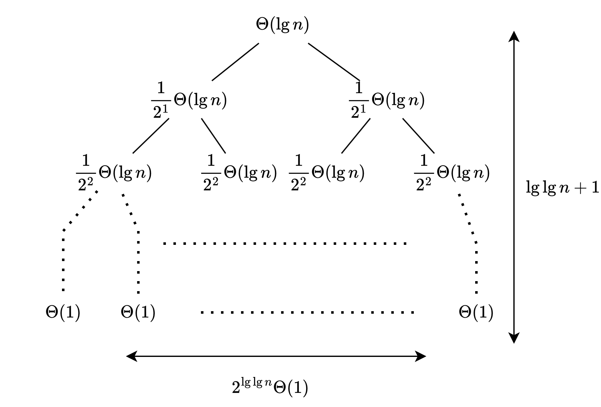

# 4-3 Solving recurrences with a change of variables

> Sometimes, a little algebraic manipulation can make an unknown recurrence similar to one you have seen before. Let’s solve the recurrence
>
> $T(n)=2T(\sqrt{n})+\Theta(\lg n)$ (4.25)
>
> by using the change-of-variables method.
>
> **a**. Define $m=\lg n$ and $S(m)=T(2^m)$. Rewrite recurrence (4.25) in terms of m and $S(m)$.
>
> **b**. Solve your recurrence for $S(m)$.
>
> **c**. Use your solution for $S(m)$ to conclude that $T(n)=\Theta(\lg n\lg\lg n)$.
>
> **d**. Sketch the recursion tree for recurrence (4.25), and use it to explain intuitively why the solution is $T(n)=\Theta(\lg n \lg\lg n)$.
>
> Solve the following recurrences by changing variables:
>
> **e**. $T(n)=2T(\sqrt{n})+\Theta(1)$.
>
> **f**. $T(n)=3T(\sqrt[3]{n})+\Theta(n)$.

## **a**

$S(m)=T(2^m)=2T(\sqrt{2^m})+\Theta(m)=2T(2^{m/2})+\Theta(m)=2S(m/2)+\Theta(m)$

## **b**

$$
\begin{aligned}
    m^{\log_{b}a}=m\cr
    f(m)=m=\Theta(m^{\log_{b}a})\cr
    S(m)=\Theta(m\lg m)
\end{aligned}
$$

## **c**

$T(n)=S(\lg n)=\Theta(\lg n\lg\lg n)$

## **d**

depth:$\lg\lg n +1$, leaves: $2^{\lg\lg n}$

The total cost over all nodes at depth $i$,for $i=0,1,\dots,\lg\lg n-1$ is $2^i\cdot \frac{1}{2^i}\Theta(\lg n)=\Theta(\lg n)$

$$
\begin{aligned}
    T(n) & =2^{\lg\lg n}\Theta(1)+\sum_{i=0}^{\lg\lg n-1}\Theta(\lg n)\cr
    & =\Theta(\lg n)+\lg\lg n\Theta(\lg n)\cr
    & = \Theta(\lg n\lg\lg n)\cr
\end{aligned}
$$

## **e**

depth:$\lg\lg n +1$, leaves: $2^{\lg\lg n}$

The total cost over all nodes at depth $i$,for $i=0,1,\dots,\lg\lg n-1$ is $2^i\cdot \Theta(1)=\Theta(2^i)$

$$
\begin{aligned}
    T(n) & =2^{\lg\lg n}\Theta(1)+\sum_{i=0}^{\lg\lg n-1}2^i\Theta(1)\cr
    & =\Theta(\lg n)+(2^{\lg\lg n}-1)\Theta(1)\cr
    & = \Theta(\lg n)\cr
\end{aligned}
$$

## **f**

$S(m)=T(3^m)=3T(3^{m/3})+\Theta(3^m)=3S(m/3)+\Theta(3^m)$.

$$
\begin{aligned}
    m^{\log_{b}a}=m^{\log_{3}3}=m\cr
    f(m)=3^m=\Omega(m^{2+\log_{b}a})\cr
    3f(m/3)=3\cdot 3^{m/3}\leq (1/3)f(m)\cr
    S(m)=\Theta(f(m))=\Theta(3^m)\cr
    T(n)=S(\log_{3}n)=\Theta(n)\cr
\end{aligned}
$$
